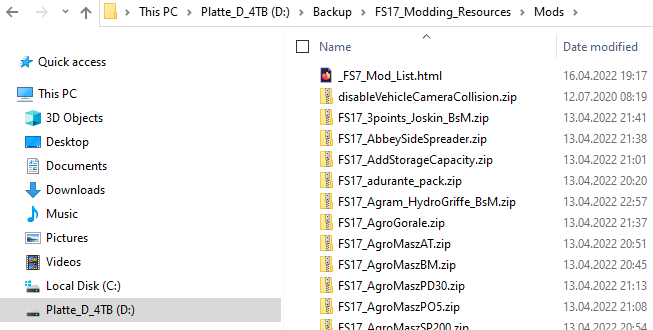
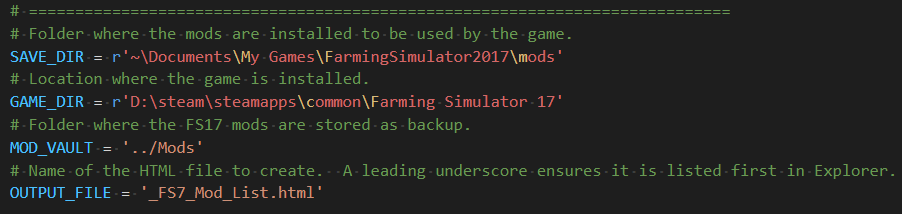
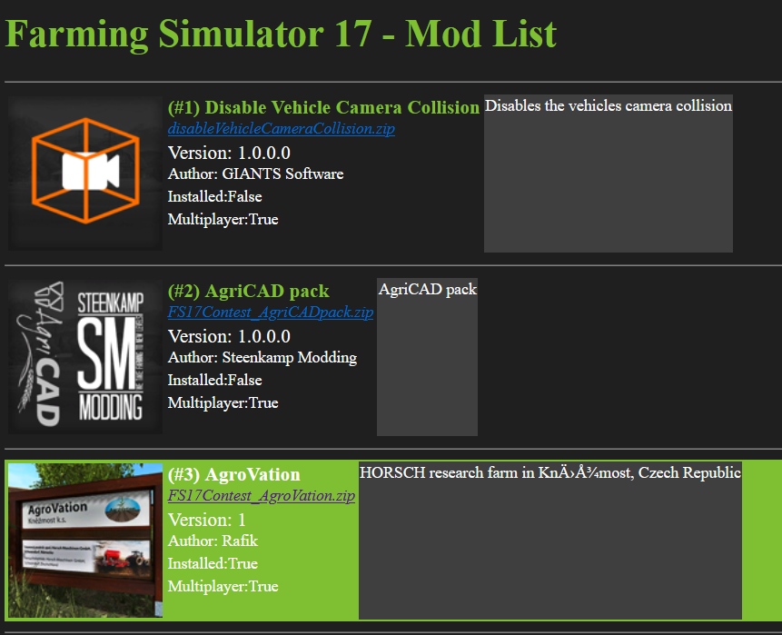

# Farming Simulator 17 Mod List Generator V0.1
Generates a HTML, listing all FS17 mods (ZIP files) in a folder.

For each Mod file found, the HTML shows

- The Icon.
- The Name, version, author, installation status and multiplayer support.
- A link to the ZIP file.
- The detailed Mod description.

As the result is plain HTML, the list can be searched for specific text in the browser.  
(Unlike the ingame ModHub.)

Also, if the ModHub shuts down in the future, this should still allow to manage the Mods in a somewhat reasonable fashion.

# Prerequisites
- Python 3.8
- PIL fork Pillow https://pillow.readthedocs.io/en/stable/  
(```pip install pillow``` worked fine for me.)
- A folder holding all your stored FS17 Mod files:  
(You have to download them yourself!)



# Configuration
The script is configured via global variables at the beginning:

- ```SAVE_DIR```: is just for checking which mods are already installed (they will be shown with green background color.)
- ```GAME_DIR```: is used to find Mod icons referencing the game store.
- ```MOD_VAULT```: is relative to the "current directory", from which the script is started.
- ```OUTPUT_FILE```: will be stored in the MOD_VAULT folder.


# Usage
Run the script without any arguments:  
```
python FS17_Mod_List.py
```
# Result
The generated HTML should look like this:



